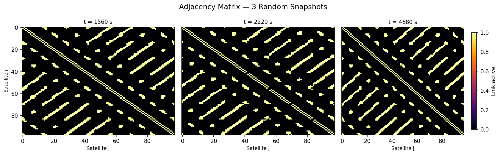
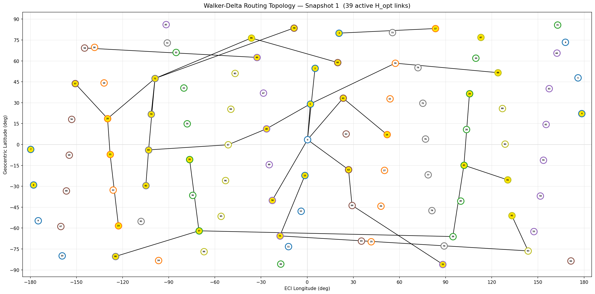
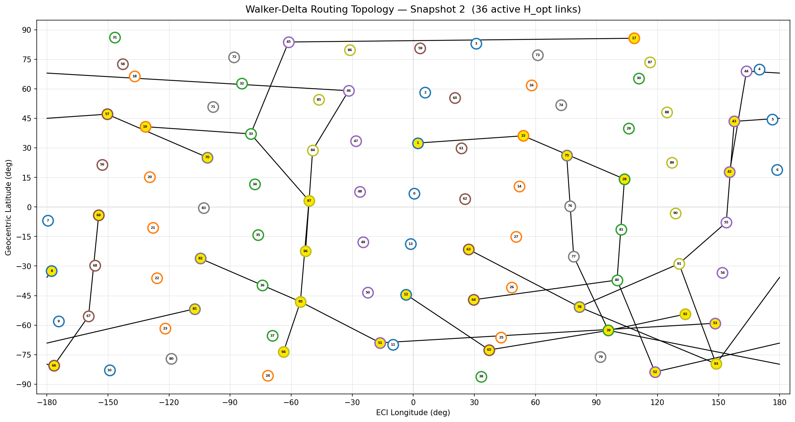
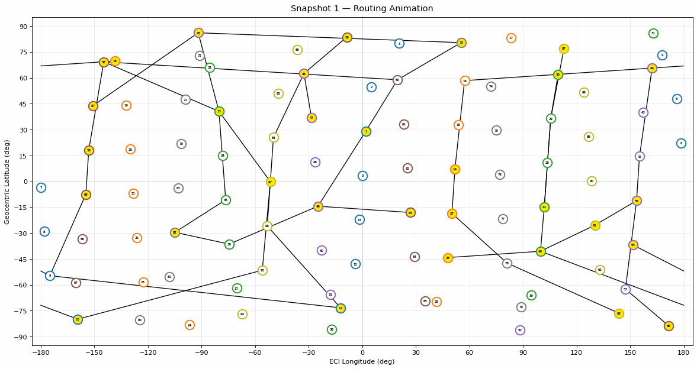

# LEO Routing Optimizer — Stochastic Link Failure

An open-source implementation of **Zhao et al. (2022)** — *"A Routing Optimization Method for LEO Satellite Networks with Stochastic Link Failure"* ([Aerospace, 9, 322](https://doi.org/10.3390/aerospace9060322)).

> **Note:** This is not original research. It is a faithful implementation of the paper above, built to educate and to show concretely how this type of system might look in practice.

---

## Table of Contents

1. [The Constellation](#1-the-constellation)
2. [Stochastic Link Failure](#2-stochastic-link-failure)
3. [The Routing Problem](#3-the-routing-problem)
4. [The Optimization Algorithm — GA-AS](#4-the-optimization-algorithm--ga-as)
5. [Results](#5-results)
6. [Repository Structure](#6-repository-structure)
7. [Setup and Usage](#7-setup-and-usage)
8. [References](#8-references)

---

## 1. The Constellation

The network is a **Walker-Delta constellation** — 98 satellites in 7 orbital planes, 14 per plane, at 1000 km altitude. This gives near-global coverage with a predictable, repeating geometry.

<p align="center">
  
</p>

Each color in the animation is one orbital plane. The links between satellites are **Inter-Satellite Laser Links (ISLLs)** which are channels used to relay data across the network (kind of like fiber optics, but in space!). Link color reflects failure probability: green is reliable, orange is marginal, red is high-risk.

Because the satellites follow known orbits, their positions at any future time are fully predictable. We know in advance which satellites can see each other and which pairs are blocked by the Earth. Rather than treating this as a continuously changing problem, the paper divides one orbital period into **100 static snapshots** of 60 seconds each and solves routing independently per snapshot. The topology is fixed within each snapshot. You can change the amount of time in one snapshot, along with the number of snapshots, in the config files. 

<p align="center">
  
</p>

Each panel is the satellite-to-satellite adjacency matrix at a different point in the orbit — black cells are active links. The sparse, banded pattern is characteristic of Walker-Delta: each satellite only connects to its immediate neighbours within and across adjacent planes, never to the full network.

---

## 2. Stochastic Link Failure

The ISLLs are laser links, which offer high bandwidth and low interference. The problem is that lasers require precise pointing, and satellite platforms vibrate. Small attitude errors cause the beam to miss the receiver, this is **pointing error**, and it is the source of randomness in an otherwise deterministic system.

The paper models this statistically: given the pointing error distribution, you can calculate the probability that the SNR on any given link drops below the threshold needed for reliable communication. This gives a per-link **failure probability** that varies with distance and transmit power. The further away two satellites are, or the weaker the transmitter, the more likely the link fails at any given moment. These probabilities feed directly into the optimizer which is a path through unreliable links is penalised regardless of its distance.

---

## 3. The Routing Problem

Each snapshot has a set of **tasks** which are satellite pairs that need to exchange data, each with a priority weight. The optimizer must find paths for all tasks simultaneously, balancing three competing objectives:

- **Maximise task revenue:** Route high-priority tasks through reliable links. A path through a risky link reduces the probability the task completes successfully, which reduces its contribution to the score.
- **Minimise link switching:** Establishing a new laser link requires physical terminal alignment, which is slow and costly. The optimizer is penalised for any link in the current solution that wasn't present in the previous snapshot's solution.
- **Minimise path distance:** Shorter paths mean lower propagation delay.

These three objectives are combined into a single weighted score. The weights (configurable in `configs/ga_params.yaml`) default to heavily favouring task reliability, with switching and distance as secondary concerns. I WANT TO NOTE: there are also hyperparameters p which are multiplied by the objectives and the weights. I chose these based off of experimentation and hardcoded them in. You can simply go to `examples/run_98_node_sim.py` and change them out there. 

Solutions are also subject to a hard physical constraint: each satellite can only maintain a limited number of simultaneous laser links (4 in/out, 2 of which are pointed to the neighbors). Any solution that violates this has its score heavily penalised rather than being discarded outright.

I also want to note, that for the sake of simplicity I chose 20 random tasks per timestep. This means the network is highly (and I mean HIGHLY) under-utilized. In the real world you would probably have hundreds if not thousands of tasks, which would require a far more connected web. 

---

## 4. The Optimization Algorithm — GA-AS

The routing problem across 98 satellites and 20 simultaneous tasks is too large for exact methods. The paper proposes **GA-AS** (Genetic Algorithm based on A\*): a genetic algorithm whose key innovation is *how it generates its initial population*.

Standard genetic algorithms seed their population randomly, which means early generations spend most of their time discovering that random paths are bad. GA-AS instead seeds each individual using a **stochastic A\*** — a modified version of A\* that, rather than always picking the single cheapest next node, uses roulette-wheel selection to pick probabilistically. Cheaper nodes are more likely to be chosen, but every reachable node has a non-zero chance. Run this once per task per individual and you get a diverse population of solutions that are already reasonably good, giving the GA a far better starting point.

From there the GA runs standard operations for up to n generations: evaluate fitness, select parents by tournament, crossover at a random split across the task list, and mutate by re-running the stochastic A\* on one randomly chosen task. The best solution found across all generations is kept as the output for that snapshot, and its routing matrix is carried forward to the next snapshot so the switching cost penalty works correctly across time.

The paper shows this produces dramatically better results than a plain GA for the same population size, especially at smaller populations where random seeding fails entirely.

---

## 5. Results

The optimizer outputs the active routing topology for each snapshot. You can see which satellite links are used and which satellites are task endpoints (yellow). Two example snapshots are shown below.

<p align="center">
  
</p>

<p align="center">
  
</p>

The animation below traces each task's routed path edge-by-edge through the active topology.

<p align="center">
  
</p>

Like I mentioned earlier, we would have far more deeper connections and actually use all 4 links on multiple satellites if there was more tasks. However, I don't have that much compute power, so... you get why I picked 20 tasks. 

---

## 6. Repository Structure

```
leo-routing-optimizer/
├── src/
│   ├── core_engine/
│   │   ├── include/
│   │   │   ├── beckmann_math.hpp
│   │   │   └── constraints.hpp
│   │   └── src/
│   │       ├── beckmann_math.cpp
│   │       ├── constraints.cpp
│   │       └── bindings.cpp
│   ├── routing/
│   │   ├── snapshot_engine.py
│   │   └── graph_manager.py
│   ├── optimization/
│   │   ├── fitness_metrics.py
│   │   └── genetic_algo.py
│   └── visualization/
│       ├── animator.py
│       └── routes_and_schedule_vis.py
├── configs/
│   ├── constellation.yaml
│   └── ga_params.yaml
├── data/
│   └── processed/
├── assets/
│   ├── gifs/
│   └── images/
├── examples/
│   └── run_98_node_sim.py
├── tests/
│   └── python/
├── docker/
│   ├── Dockerfile
│   └── docker-compose.yml
├── CMakeLists.txt
├── pyproject.toml
└── requirements.txt
```

---

## 7. Setup and Usage

### Option A — Docker (recommended)

Docker handles the C++ build automatically. You only need Docker and Docker Compose installed.

```bash
git clone https://github.com/<your-username>/leo-routing-optimizer.git
cd leo-routing-optimizer

# Build and run (first 5 snapshots by default)
docker compose -f docker/docker-compose.yml up --build
```
Results are written to `data/processed/` on your host via the mounted volume. To run all 100 snapshots:

```bash
docker compose -f docker/docker-compose.yml run leo-optimizer \
    python examples/run_98_node_sim.py --all
```

---

### Option B — Local build

**Prerequisites:** Python 3.10+, CMake ≥ 3.12, g++ (C++17), Eigen3 (`sudo apt install libeigen3-dev`)

```bash
# 1. Virtual environment
python3 -m venv .venv && source .venv/bin/activate

# 2. Install deps and build the C++ extension
pip install -r requirements.txt
pip install --no-build-isolation .

# 3. Generate snapshot data (writes to data/processed/simulation_data.h5)
python src/routing/snapshot_engine.py

# 4. Run the optimizer
python examples/run_98_node_sim.py            # single snapshot
python examples/run_98_node_sim.py --first 5  # first N snapshots
python examples/run_98_node_sim.py --all      # all 100 snapshots

# 5. Visualizations
python src/visualization/animator.py                # constellation GIF
python src/visualization/routes_and_schedule_vis.py # topology PNGs + path GIF

# 6. Tests
pytest tests/
```

Results are saved to `data/processed/results_<timestamp>.json`.

---

## 8. References

```bibtex
@Article{aerospace9060322,
  AUTHOR  = {Zhao, Guohong and Kang, Zeyu and Huang, Yixin and Wu, Shufan},
  TITLE   = {A Routing Optimization Method for LEO Satellite Networks with Stochastic Link Failure},
  JOURNAL = {Aerospace},
  VOLUME  = {9},
  YEAR    = {2022},
  NUMBER  = {6},
  ARTICLE-NUMBER = {322},
  URL     = {https://www.mdpi.com/2226-4310/9/6/322},
  ISSN    = {2226-4310},
  DOI     = {10.3390/aerospace9060322}
}
```

---

## License

MIT — see [LICENSE](LICENSE).

---
